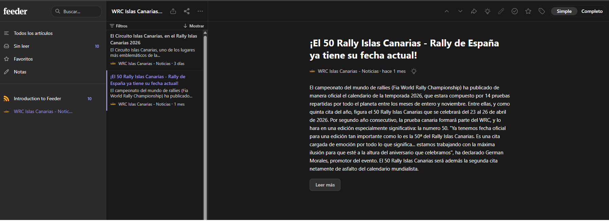

# 📄 Description

This project is a submission for the Web Development module, a prototype created using **React**, **Vite**, and **CSS**.  
The goal is to build a webpage that promotes the **WRC Rally Islas Canarias 2026**, with structure, styling, and interactivity.

The prototype includes:
- A responsive main page with a Hero section and a Featured Gallery.
- A Gallery displaying Rally cars using JSON data.
- A Contact page with a functional modal.
- Navigation between sections using React Router.
- Visual design using CSS inspired by the Canary Islands flag.
- Basic JavaScript features (e.g., show/hide elements, modal logic).
- Integration of third-party components (Leaflet Map).

## 🌐 Live Demo

You can view the deployed project live here: **[https://base-de-datos-wrc.web.app](https://base-de-datos-wrc.web.app)**

## 🎨 Design Inspiration

The visual style and UI layout of this project were partially inspired by the **Official WRC Website** and the colors of the **Canary Islands**, which influenced the use of spacing, color contrast (Yellow/Blue/White), card layouts, and component styling.

## 🛠️ Technologies Used

-   React 
-   Vite
-   CSS3 (Custom styles with Flexbox & Grid)
-   Leaflet & React-Leaflet (For map integration)
-   Firebase (Realtime Database for contact form submissions)
-   Graphic resources: images and icons

## 📂 Project Structure

    /src
    ├── assets/
    ├── components/
    │   ├── footer/
    │   ├── gallery-item/
    │   ├── header/
    │   ├── map/
    │   └── modal/
    ├── pages/
    │   ├── contact/
    │   ├── gallery/
    │   ├── home/
    │   ├── legal/
    │   └── news/
    ├── services/
    │   ├── firebase.service.js
    │   └── rss.xml
    ├── App.jsx
    ├── App.css
    ├── index.css
    └── main.jsx

## 🆕 Recent Additions

The project has been enhanced with several new interactive and visual features:

- **Canary Islands Theme:**  
  A gradient background representing the Canary Islands flag has been applied to the entire application.

- **Hamburger Menu:**  
  A fully responsive hamburger menu allows navigation on all screen sizes.

- **Firebase Integration & Contact Form:**  
  The contact page has been redesigned for a better visual user experience. The form is now fully functional, saving user messages directly to a Firebase Realtime Database and displaying a custom modal window to confirm successful submissions.

- **Interactive Gallery & Hero:**  
  Clicking on the hero title or gallery items reveals additional information.

- **News Section & RSS Feed:**  
  Integrated a news page featuring interactive expandable images (accordion effect). The project now includes a functional RSS feed successfully relocated to `public/rss.xml` and accessible from the header logo. This RSS feed is fully compatible with external RSS reading platforms (such as Feeder).
  
  

- **Hosting & Deployment:**  
  The application has been fully built and deployed to **Firebase Hosting**, making it publicly accessible over the web.

- **CRUD Operations:**  
  Full CRUD (Create, Read, Update, Delete) functionality has been implemented to manage application data directly from the interface.


## ✅ How to Use / View the Project

1.  Clone this repository:
    ```bash
    git clone https://github.com/victormanuelgarciabatista-arch/UT4-WRC-FANPAGE.git
    ```

2.  Navigate into the project folder:
    ```bash
    cd WRC-Rally-Islas-Canarias-2026
    ```

3.  Install dependencies:
    ```bash
    npm install
    ```

4.  Run the development server:
    ```bash
    npm run dev
    ```

5.  Open the link shown in your terminal (usually `http://localhost:5173`) in your browser.

## 🙏 Acknowledgements

Special thanks to:

- my classmates because some still trust me and help me keep going.
- My teacher **Tiburcio**, for approving my work. 


## 👤 Author

**Víctor Manuel García Batista**  
GitHub: https://github.com/victormanuelgarciabatista-arch
Url: https://base-de-datos-wrc.web.app/
## 📄 License

This project is licensed under the MIT License.

